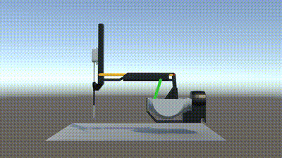

# MAURF-dVRK: Multi-Agent Unified Reinforcement Framework for da Vinci Research Kit

<div align="center">
  
</div>

<div align="center">

### [Luigi Muratore](https://github.com/luigimuratore)¹, [Federica Barontini](#)¹², [Giuseppe Averta](https://scholar.google.com/citations?user=i4rm0tYAAAAJ&hl=en&oi=ao)¹

¹Politecnico di Torino | ²Minimally Invasive Therapy and Innovation Center

[**[Paper]**](#) | [**[Documentation]**](#) | [**[Website]**](https://luigimuratore.github.io/MAURF-dVRK/)

</div>

---

## 📋 Abstract

**Purpose:** Reliable automation of surgical suturing requires accurate and flexible simulation tools that bridge learning and clinical practice. This work presents a unified Unity–ROS simulation framework for autonomous surgical robotics with the da Vinci Research Kit (dVRK). The framework supports reinforcement-learning-based training of surgical tasks such as needle grasping and placement, while also enabling interactive teleoperation and surgical training. Real-time communication with the dVRK master console allows surgeon control of simulated patient-side manipulators (PSMs), and an integrated graphical user interface (GUI) supports environment tuning for reward design, algorithm development, and sim-to-real validation.

**Methods:** A physics-based surgical environment was developed in Unity, incorporating a full kinematic reconstruction of the dVRK to ensure accurate joint-level and end-effector behavior. Bidirectional ROS communication enables real-time control, state streaming, and visualization between the simulation and the physical master console. Proximal Policy Optimization (PPO) was used for policy training, combined with curriculum learning to progressively increase task difficulty. Domain randomization was applied to improve robustness and generalization. In addition, a multi-agent reinforcement learning strategy is under investigation to enhance cooperative performance in complex tasks such as suturing.

**Results:** Preliminary simulations demonstrated stable policy convergence and precise execution of autonomous needle manipulation tasks. Policies trained with domain randomization showed increased robustness to visual and positional variations, achieving consistent performance across randomized conditions and indicating improved generalization.

**Conclusions:** The proposed Unity–ROS–dVRK framework provides a modular, high-fidelity platform for developing and benchmarking autonomous surgical skills. By integrating accurate kinematics, reinforcement learning, and teleoperation, it supports both autonomous training and human-in-the-loop control in realistic surgical scenarios. Direct ROS connectivity and an integrated GUI further facilitate rapid development and sim-to-real experimentation.

**Keywords:** da Vinci Research Kit (dVRK); surgical robotics; reinforcement learning; Unity; ROS; multi-agent systems; autonomous surgery; simulation.

---

## Key Features

- 🤖 **Multi-agent coordination and collaboration**
- 🎯 **Unified reinforcement learning framework**
- 🖥️ **Graphics User Interface (GUI)**
- 🔗 **ROS integration**
- 🏥 **Integration with da Vinci Research Kit**

---

## 🎬 Demo Videos

For interactive demos, visit our [**project website**](https://luigimuratore.github.io/MAURF-dVRK/).

### Single Agent Tasks

<table>
  <tr>
    <td align="center"><b>Reaching Task</b></td>
    <td align="center"><b>Placement Task</b></td>
    <td align="center"><b>Complete Task</b></td>
  </tr>
  <tr>
    <td align="center"><i>Seed 42, 11, 2026</i></td>
    <td align="center"><i>Seed 42, 11, 2026</i></td>
    <td align="center"><i>Seed 42, 11, 2026</i></td>
  </tr>
</table>

### Multi-Agent Coordination

Collaborative multi-agent demonstrations showing coordinated surgical task execution.

---

## 🏗️ System Architecture

<table>
  <tr>
    <td align="center">
      
      <p><i>System Architecture Overview</i></p>
    </td>
    <td align="center">
      
      <p><i>Multi-Agent Coordination Framework</i></p>
    </td>
  </tr>
</table>

---

## 🤖 Kinematic Model of PSM

Development progression of the Patient Side Manipulator (PSM) kinematic model with constraint implementation.

<div align="center">
  
  <p><i>Kinematic model of the PSM</i></p>
</div>

---

## 📊 Training Results

<div align="center">
  
  
  
  <p><i>Training convergence for different tasks</i></p>
</div>

---

## 🚀 Getting Started

### Prerequisites

- Unity 2021.3+
- ROS Noetic
- Python 3.8+
- dVRK hardware (optional for sim-to-real)

### Installation

```bash
# Clone the repository
git clone https://github.com/luigimuratore/MAURF-dVRK.git
cd MAURF-dVRK

# Install Python dependencies
pip install -r requirements.txt

# Setup ROS workspace
# Follow instructions in SETUP.md
```

### Running the Simulation

```bash
# Launch the Unity simulation
# (Instructions in documentation)

# Start ROS nodes
...

# Train a policy
mlagent ...
```

For detailed setup instructions, see [SETUP.md](SETUP.md).

---

---

## 📚 Citation

If you use this work in your research, please cite:

```bibtex
@article{muratore2025maurf,
    title={MAURF-dVRK: Multi-Agent Unified Reinforcement Framework for da Vinci Research Kit},
    author={Luigi Muratore and Federica Barontini and Giuseppe Averta},
    journal={Conference/Journal Name},
    year={2026}
}
```

---

## 📧 Contact

For questions or collaboration opportunities, please reach out:

- **Email:** luigi.muratore@studenti.polito.it
- **GitHub:** [@luigimuratore](https://github.com/luigimuratore)

---

## 🙏 Acknowledgments

This page template is adapted from [CRESSim](https://tbs-ualberta.github.io/CRESSim/) and [Nerfies](https://nerfies.github.io/).

---

<div align="center">
  <p>© 2025 MAURF-dVRK Project</p>
</div>

- GitHub: [@luigimuratore](https://github.com/luigimuratore)

